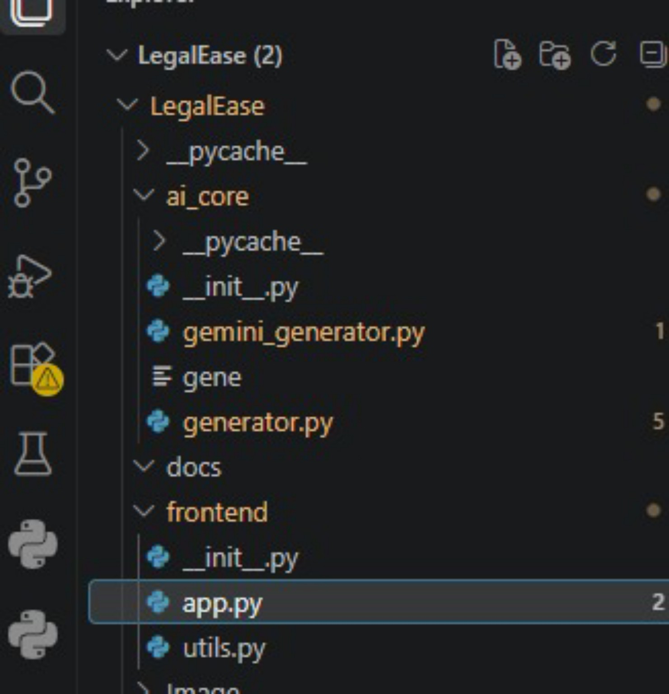

# 3. Project Design Phase — LegalEase

## Architecture Flow
```
USER → STREAMLIT FRONTEND → HTTP POST /generate → FASTAPI BACKEND
     → PYDANTIC VALIDATION → GEMINI DOCUMENT GENERATOR → GEMINI 1.5 PRO
     → GENERATED LEGAL DOCUMENT → SANITIZE → PREVIEW / EDIT → TXT / DOCX / PDF
```

## Layered Design
| Layer | Location | Components |
|-------|----------|-----------|
| Frontend (Streamlit) | `frontend/app.py` | Input form, HTML preview, inline editor, download buttons |
| Backend API (FastAPI + Uvicorn) | `legalEaseAPI/main.py`, `routes.py` | `GET /`, `POST /generate`, `DocumentRequest` model, error handling |
| AI Core | `ai_core/gemini_generator.py` | Load API key (.env), prompt builder, Gemini `generate_content()` |
| Formatting Utilities | `frontend/utils.py` | `sanitize_text()`, `format_docx()`, `format_pdf()`, `format_html_preview()` |

## User Flow
1. Open LegalEase
2. Enter Document Type
3. Enter Parties Involved
4. Enter Terms & Conditions
5. Enter Effective Date
6. Click **Generate Document**
7. Preview generated document
8. Edit if required
9. Download TXT / DOCX / PDF

## API Design
| Method | Endpoint | Purpose |
|--------|----------|---------|
| GET | `/` | Health check / welcome message |
| POST | `/generate` | Generate a legal document |

**Request body**
```json
{
  "document_type": "Freelance Work Contract",
  "parties": "Jane Doe (Service Provider), TechNova Inc. (Client)",
  "terms": "Work must be delivered by May 15, 2025; Payment within 7 days of invoice; Confidentiality must be maintained at all times",
  "dates": "April 15, 2025"
}
```
**Response**
```json
{ "document": "<generated legal document text>" }
```

## Prompt Design
The prompt contains the document type, parties, effective date, and terms, and asks Gemini for a formal legal structure with numbered headings and standard clauses (confidentiality, governing law, signatures).

## Export Design
- **DOCX:** logo header, centered title, Times New Roman 11 pt body, footer
- **PDF:** fpdf2, branded header/footer, centered title, headings
- **TXT:** raw sanitized text
- **HTML preview:** converts line breaks for display in Streamlit

## Folder Structure (screenshot)

