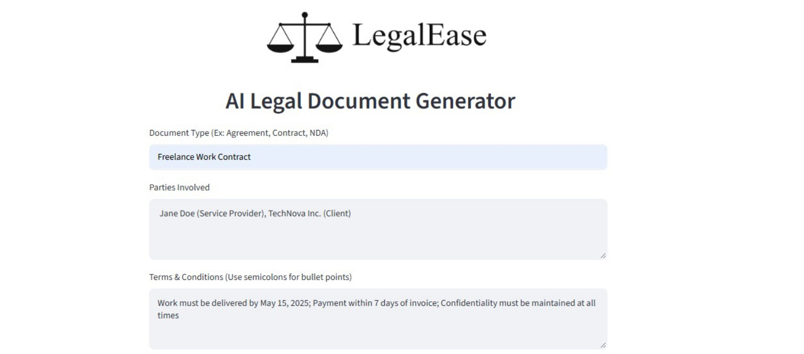
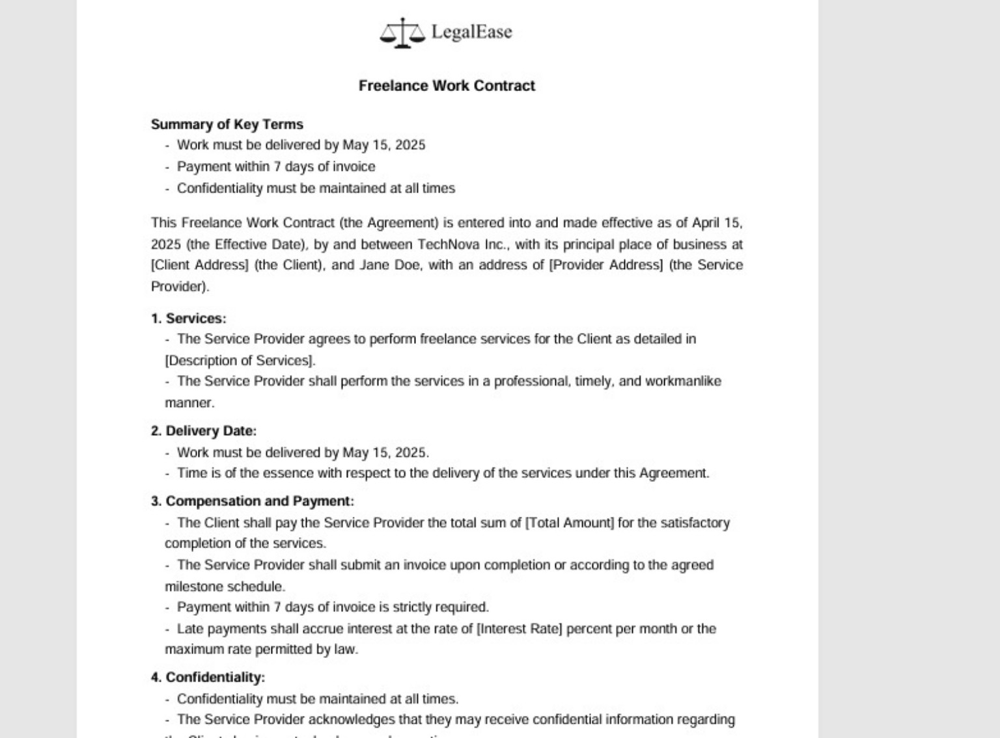
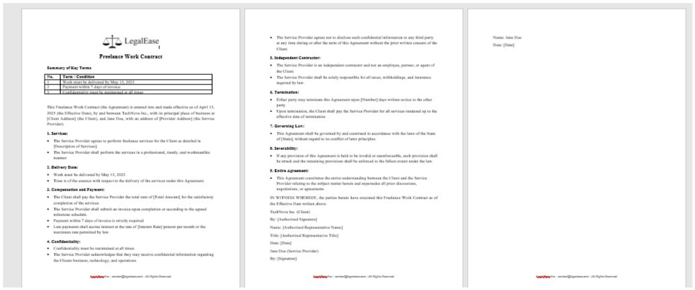

# 8. Project Demonstration — LegalEase

## Run the project
```bash
cd "5. Project Development Phase"
python -m venv venv
venv\Scripts\activate            # Windows  (macOS/Linux: source venv/bin/activate)
pip install -r requirements.txt
copy .env.example .env           # add your GEMINI_API_KEY inside .env

# Terminal 1 — backend
uvicorn legalEaseAPI.main:app --reload
# Terminal 2 — frontend
streamlit run frontend/app.py
```

## Demo steps
1. Open the Streamlit page (`http://localhost:8501`).
2. Enter Document Type, Parties, Terms and Effective Date.
3. Click **Generate Document**.
4. Review the preview, click **Edit** if changes are needed.
5. Download as TXT / DOCX / PDF.

## Screenshots
**Input interface**



**Generated legal document**



**Final document with signature section**



## Demo Video
_Add your video link here (YouTube / Google Drive)._
